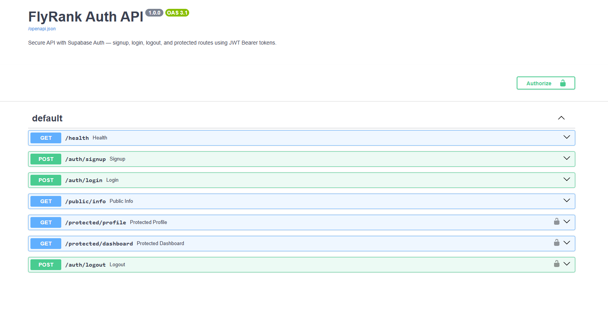

# FlyRank Auth API — Login & Protect (W4)

A secure REST API built with **FastAPI** and **Supabase Auth** that handles user Sign Up, Log In, and Log Out, and protects private routes using JWT Bearer tokens.

## Stack

- **Framework:** FastAPI (Python 3.10+)
- **Identity Provider:** Supabase Auth (issues and verifies JWTs)
- **API Docs:** Swagger UI at `/docs`
- **Config:** `.env` (ignored) + `.env.example` (committed)

## Setup

1. Clone the repository:

```powershell
git clone https://github.com/daniyalfaisal2005/Flyrank.git
cd Flyrank
```

2. Create and activate a virtual environment:

```powershell
python -m venv .venv
.venv\Scripts\activate
```

3. Install dependencies:

```powershell
pip install -r requirements.txt
```

4. Create a `.env` file from the template and fill in your own Supabase credentials:

```powershell
Copy-Item .env.example .env
```

```env
SUPABASE_URL=https://your-project-ref.supabase.co
SUPABASE_KEY=your-anon-key
PORT=3000
```

> Find these values in your Supabase Dashboard under **Project Settings → API**.
> **Never commit your `.env` file** — it is excluded by `.gitignore`.

## Run

```powershell
py -3 server.py
```

The server starts at `http://localhost:3000` and logs:

```
Server running and connected to Supabase
```

Health check: `GET /health` → `{"status":"ok","server":"running","supabase":"connected"}`

## API Reference

| Method | Path | Description | Auth Required |
| --- | --- | --- | --- |
| POST | `/auth/signup` | Create a new user account → 201 | No |
| POST | `/auth/login` | Authenticate and receive JWT → 200 | No |
| POST | `/auth/logout` | Terminate the session → 204 | Yes (Bearer) |
| GET | `/protected/profile` | Read private user profile → 200 | Yes (Bearer) |
| GET | `/protected/dashboard` | Read private dashboard → 200 | Yes (Bearer) |
| GET | `/public/info` | Read public, unprotected data → 200 | No |
| GET | `/health` | Server + Supabase connectivity check | No |

### Status codes

| Code | When |
| --- | --- |
| 200 | Successful login or read |
| 201 | Successful sign up |
| 204 | Successful logout |
| 400 | Missing/empty input fields |
| 401 | Missing, incorrect, or expired token; invalid credentials |
| 503 | Supabase unreachable (health check) |

### Example flow (curl)

```powershell
# 1. Sign up
curl -X POST http://localhost:3000/auth/signup -H "Content-Type: application/json" -d '{"email":"you@example.com","password":"password123"}'

# 2. Log in (returns access_token)
curl -X POST http://localhost:3000/auth/login -H "Content-Type: application/json" -d '{"email":"you@example.com","password":"password123"}'

# 3. Call a protected route
curl http://localhost:3000/protected/profile -H "Authorization: Bearer <YOUR_ACCESS_TOKEN>"

# 4. Log out
curl -X POST http://localhost:3000/auth/logout -H "Authorization: Bearer <YOUR_ACCESS_TOKEN>"
```

## Swagger UI

Open **http://localhost:3000/docs**, click the **Authorize** lock button, paste your JWT, and try the protected endpoints directly from the browser.



## Security Notes

- Passwords are hashed and managed by Supabase — never stored in this codebase.
- Protected routes use a reusable `get_current_user` dependency (FastAPI's equivalent of middleware) that verifies the Bearer token via `supabase.auth.get_user()`.
- Logout revokes the session server-side, so the token becomes invalid immediately after.
- `.env` with Supabase keys is listed in `.gitignore` and is never pushed to GitHub.
