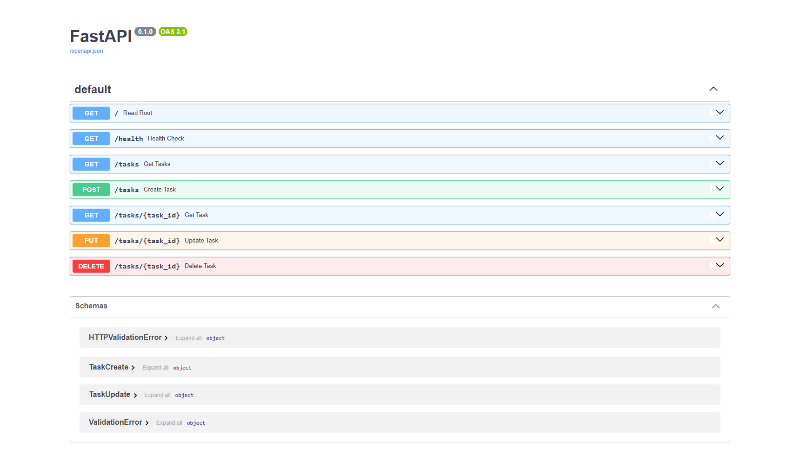
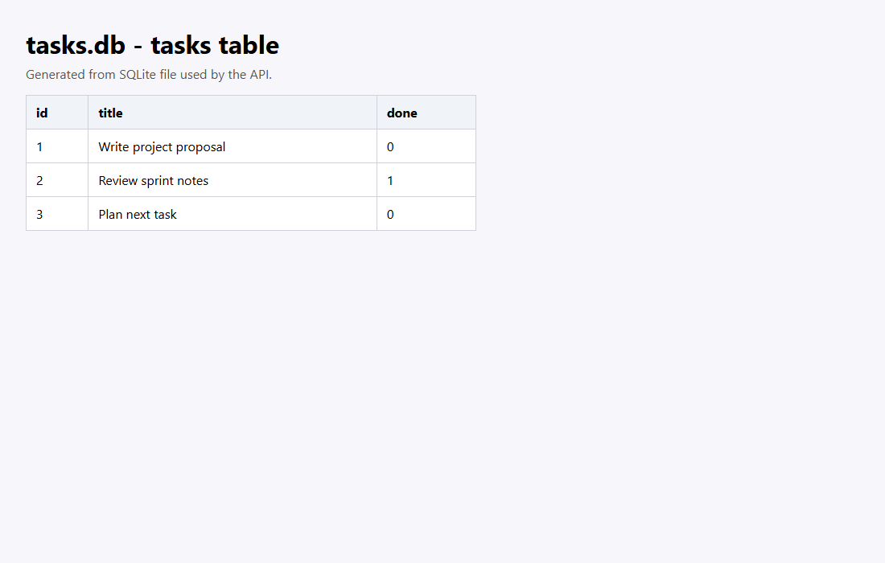

# Task API

A task CRUD API built with Python and FastAPI, now backed by SQLite for persistence.

## Why SQLite

SQLite was chosen because it is lightweight, requires zero server setup, and stores data in a single local file. This makes it ideal for learning SQL and proving persistence while keeping setup simple.

## Database file

The database file is `tasks.db` in the project root. It is created automatically on app startup if missing.

On first run, the app also:

- creates the `tasks` table if it does not exist
- seeds exactly three example tasks only when the table is empty

## Run

Use Python 3.14 or newer with compatible FastAPI wheels:

```powershell
py -3.14 -m venv .venv
.\.venv\Scripts\Activate.ps1
python -m pip install -r requirements.txt
python "W3 A1.py"
```

The API runs at `http://127.0.0.1:8000`. Swagger UI is available at `http://127.0.0.1:8000/docs`.

## Endpoints

| Method | Path | Description |
| --- | --- | --- |
| GET | `/` | Return API metadata |
| GET | `/health` | Check API health |
| GET | `/tasks` | List all tasks |
| GET | `/tasks/{task_id}` | Return one task |
| POST | `/tasks` | Create a task |
| PUT | `/tasks/{task_id}` | Update a task |
| DELETE | `/tasks/{task_id}` | Delete a task |

## Example SQL query

```sql
SELECT * FROM tasks WHERE done = 1;
```

This returns only completed tasks.

## curl example

```powershell
curl -i http://127.0.0.1:8000/health
```

Output:

```json
HTTP/1.1 200 OK
content-type: application/json

{"status":"ok"}
```

## Swagger screenshot



## DB Browser screenshot


